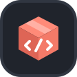

<p align="center">
  
</p>

<h1 align="center">Seller SDK</h1>

<p align="center">
  <strong>Типобезопасные TypeScript-клиенты для Seller API российских маркетплейсов.</strong>
</p>

<p align="center">
  <a href="https://github.com/dev-ik/seller-sdk/actions/workflows/ci.yml"></a>
  <a href="./docs/ozon/API-REFERENCE.md"></a>
  <a href="./docs/wb/API-REFERENCE.md"></a>
  <a href="./package.json"></a>
  <a href="./tsconfig.base.json"></a>
  <a href="./LICENSE"></a>
</p>

SDK поддерживает Ozon Seller API и Wildberries API. Можно установить только
нужную площадку или использовать общий пакет для multi-marketplace приложения.

## Документация пакетов

- [`@seller-sdk/ozon`](./packages/ozon/README.md) — установка, настройка и
  примеры Ozon; [полный API Reference](./docs/ozon/API-REFERENCE.md).
- [`@seller-sdk/wb`](./packages/wb/README.md) — установка, настройка и примеры
  Wildberries; [полный API Reference](./docs/wb/API-REFERENCE.md).

## Быстрый старт

Для проекта, который работает только с Ozon:

```bash
npm i @seller-sdk/ozon
```

```ts
import { OzonClient, OzonValues } from "@seller-sdk/ozon";

const ozon = new OzonClient({
  clientId: process.env.OZON_CLIENT_ID!,
  apiKey: process.env.OZON_API_KEY!,
});

const products = await ozon.products.list({
  filter: {
    visibility: OzonValues.ProductListVisibility.All,
  },
  limit: 100,
});
```

Для проекта, который работает только с Wildberries:

```bash
npm i @seller-sdk/wb
```

```ts
import { WbClient, WbValues } from "@seller-sdk/wb";

const wb = new WbClient({ token: process.env.WB_API_TOKEN! });
const connection = await wb.general.getPing();
const tariffs = await wb.general.getTariffConstructorOptions({
  query: { locale: WbValues.GetV1TariffConstructorOptionsLocale.Ru },
});
```

Для приложения, которому нужна единая точка входа:

```bash
npm i seller-sdk
```

```ts
import { Marketplace, SellerClient } from "seller-sdk";

const seller = new SellerClient({
  marketplace: Marketplace.Ozon,
  credentials: {
    clientId: process.env.OZON_CLIENT_ID!,
    apiKey: process.env.OZON_API_KEY!,
  },
});

const roles = await seller.ozon.access.getRoles();
```

Использовать одновременно `seller-sdk` и focused package не требуется.

## Почему SDK удобно использовать

- Все 461 операция Ozon распределены по предметным областям.
- Все 286 операций WB распределены по 13 официальным разделам.
- TypeScript подсказывает обязательные поля, ограничения и закрытые наборы
  значений.
- Ответы проверяются во время выполнения через SafeShape.
- Версионные семейства имеют рекомендуемые методы без суффикса версии.
- Тайм-ауты, отмена, безопасные повторы и метаданные ответа настраиваются единообразно.
- Для распространённых списков есть ленивые async-итераторы.
- Новые методы Ozon можно временно вызвать через fixed-origin `rawRequest`.

## Методы без версии

В прикладном коде используйте имя без версии. SDK направит вызов на актуальный
поддерживаемый контракт:

```ts
await ozon.warehouses.listWarehouses({ limit: 100 }); // сейчас v2
await ozon.finance.listFinanceTransactions(input); // сейчас v3
await wb.general.getNews({ query: { from: "2026-08-01" } }); // сейчас v2
```

Явную версию используйте только для намеренной фиксации контракта:

```ts
await ozon.warehouses.listWarehousesV2({ limit: 100 });
await wb.general.getV2News({ query: { from: "2026-08-01" } });
```

Если Ozon пометил контракт устаревшим, IDE зачеркнёт и версионный метод, и его
алиас. Например, `listFinanceTransactions` устаревает 8 сентября 2026 года;
для нового кода используйте `finance.accruals`.

## Конфигурация запросов

Оба клиента поддерживают одинаковые настройки тайм-аутов, общего дедлайна,
повторов, отмены и наблюдения за ответами.

### Ozon

```ts
const ozon = new OzonClient(credentials, {
  timeoutMs: 30_000,
  deadlineMs: 60_000,
  maxRetries: 2,
  onResponse({ operationId, status, requestId, attempt, willRetry }) {
    console.info({ operationId, status, requestId, attempt, willRetry });
  },
});

await ozon.products.list(input, {
  timeoutMs: 10_000,
  maxRetries: 1,
  signal: abortController.signal,
});
```

### Wildberries

```ts
const wb = new WbClient(
  { token: process.env.WB_API_TOKEN! },
  {
    environment: "production",
    timeoutMs: 30_000,
    deadlineMs: 60_000,
    maxRetries: 2,
    onResponse({ operationId, status, requestId, attempt, willRetry }) {
      console.info({ operationId, status, requestId, attempt, willRetry });
    },
  },
);

await wb.general.getNews(
  { query: { from: "2026-08-01", fromID: 42 } },
  {
    timeoutMs: 10_000,
    deadlineMs: 30_000,
    maxRetries: 1,
    signal: abortController.signal,
  },
);
```

`maxRetries` задаёт количество повторов после первой попытки. SDK повторяет
только безопасные операции чтения: `GET` и методы, отмеченные в Swagger как
`x-readonly-method`. Мутации не повторяются автоматически независимо от
`maxRetries`.

## Пагинация

```ts
for await (const product of ozon.products.listAll({
  filter: {},
  limit: 100,
})) {
  console.log(product.offer_id);
}
```

`listPages()` возвращает страницы, а `listAll()` — отдельные элементы без
накопления всего ответа в памяти. Готовые итераторы есть для товаров, FBO и FBS.

## Обработка ошибок

```ts
import { toSellerSdkErrorDetails } from "@seller-sdk/ozon";

try {
  await ozon.products.list({ filter: {}, limit: 100 });
} catch (error) {
  console.error(toSellerSdkErrorDetails(error));
}
```

`toSellerSdkErrorDetails()` одинаково работает для Ozon, WB и umbrella-пакета.
Результат содержит стабильные `code`, `message`, `operationId`, HTTP status,
request ID, API code/message и validation issues, когда они доступны. В него не
включаются stack, cause, ключ API, `Client-Id` и заголовки авторизации.

## Требования

- Node.js 20.10 или новее;
- ESM;
- TypeScript рекомендуется, но собранный JavaScript также поддерживается;
- секреты продавца должны использоваться только на сервере.

Поддержка браузера не заявляется: ключи Seller API нельзя передавать в клиентское
приложение.

## Документация

- [Публичный API](PUBLIC_API.md)
- [Полный справочник Ozon](docs/ozon/API-REFERENCE.md)
- [Архитектура](ARCHITECTURE.md)
- [Источник контрактов Ozon](docs/OZON-SOURCE-OF-TRUTH.md)
- [Процесс добавления endpoint](docs/ENDPOINT-WORKFLOW.md)
- [История изменений](CHANGELOG.md)
- [Политика безопасности](SECURITY.md)

## Разработка

```bash
pnpm install
pnpm release:check
```

`release:check` проверяет форматирование, сгенерированные файлы, lint,
TypeScript, тесты, сборку, состав tarball и установку в чистый consumer-проект.

## Лицензия и товарные знаки

[MIT](LICENSE) © Seller SDK contributors.

Seller SDK — независимый open-source проект. Он не связан с Ozon или
Wildberries, не одобрен и не спонсируется ими либо другими маркетплейсами.
Названия маркетплейсов используются только для обозначения совместимости с их
API.
